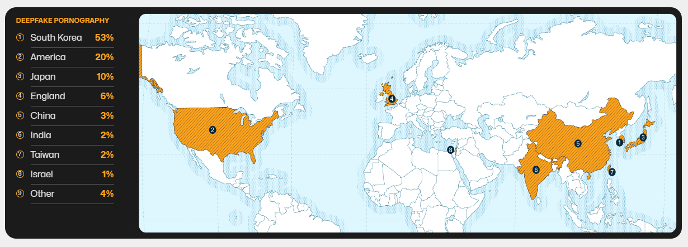

# 페이크 버스터즈 <!-- omit from toc -->

<h3>24-2 YBIGTA 컨퍼런스</h3>

<em>딥페이크 탐지 모델</em>

## 목차
- [목차](#목차)
- [문제 정의](#문제-정의)
- [선행 연구](#선행-연구)
- [세부 목표](#세부-목표)
- [접근 방법](#접근-방법)
- [결과 및 주요 기능](#결과-및-주요-기능)
- [팀 구성](#팀-구성)

## 문제 정의
### 불법 음란물 유포로 인한 피해 확산 <!-- omit from toc -->
생성형 AI의 발전과 함께 다양한 문제가 발생하고 있으며, 최근 주목받고 있는 문제 중 하나는 딥페이크 기술을 이용한 음란물 생성 및 유포입니다. 2023년 미국 사이버보안 업체 Security Hero의 보고서에 따르면, 딥페이크 포르노 범죄율이 가장 높은 나라는 대한민국으로, 사태의 심각성을 보여줍니다.

### 유명인사 이외의 일반인에 대한 딥페이크 영상 유포 <!-- omit from toc -->
기술 발전과 편리함의 증가로 인해 이제는 유명인뿐만 아니라 일반인들도 딥페이크 음란물의 피해자가 되고 있습니다. 예를 들어, 2023년 기준 딥페이크 음란물로 피해를 입은 10대 청소년은 86명이었으나, 2024년 8월까지 그 수가 238명으로 급증했습니다.

## 선행 연구
*(Optional 필드; 생략해도 무관)*

## 세부 목표

*(세부적인 목표 및 계획)*

## 접근 방법

1. **태스크** *(세부 목표를 달성하기 위한 구체적인 태스크)*
    - (Task)
        - (Description)
    - (Task)
        - (Description)

2. **데이터셋** *(사용한 데이터셋, API 등)*
    - (Dataset A)
        - (Description)
    - (Dataset B)
        - (Description)

3. **모델링/아키텍쳐 등** *(프로젝트 특성 및 목표에 따라)*
    - (Models)
        - (Description)
    - (Service Architecture)
        - (Description)

## 결과 및 주요 기능

*(평가 지표, 구현한 핵심 기능 등)*

## 팀 구성

|이름|팀|역할|
|-|-|-|
|박동연|DS|(역할)|
|이동렬|DS|(역할)|
|정회수|DA|(역할)|
|양인혜|DS|(역할)|
|임채림|DE|(역할)|
|성현준|DE|(역할)|
|정다연|DS|(역할)|
