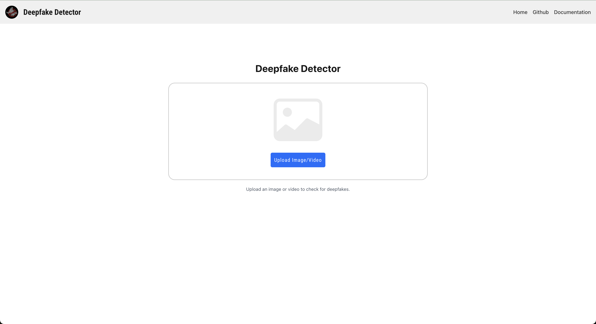

# Web-UI

## 실행 가이드

### 설치
실행에 앞서 필요한 패키지를 설치합니다.  

**알맞는 위치로 이동:**  
`cd frontend/dbust`  

**패키지 설치:**  
`npm install`

### 실행
설치를 완료했다면, 개발 서버를 실행합니다.

**개발 서버 실행:**   
`npx run dev`

## 설정 옵션
인퍼런스 서버의 주소를 변경하거나, 포트를 변경할 수 있습니다.

해당 설정은 `config.yaml` 파일에서 변경할 수 있습니다.

## 주요 사용 방법
### 메인 페이지
메인 페이지에는 딥페이크 확률 여부를 확인할 영상을 업로드 할 수 있는 기능이 있습니다.

이때, 업로드한 영상은 인퍼런스 서버로 전송되어 총 3가지 방법으로 딥페이크 여부를 확인합니다.

1. **Lip-Reading**  
    영상의 입모양을 분석하여 딥페이크 여부를 확인합니다.   

    

1. **Augmentation**  
    영상을 변형하여 딥페이크 여부를 확인합니다.

<table>
  <tr>
    <th>Original</th>
    <th>Augmented</th>
  </tr>
  <tr>
    <td></td>
    <td></td>
  </tr>
</table>

3. **PPG**  
    영상의 PPG 신호를 분석하여 딥페이크 여부를 확인합니다.

<table>
  <tr>
    <td></td>
    <td></td>
  </tr>
</table>

