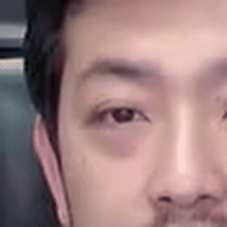

# Video ROI Extractor & FACTOR Inference

<p align="center">
  
</p>

<p align="center">
  Original Video
</p>

|           |           |           |
|-----------------------------------|------------------------------------|-------------------------------------|
| <div align="center">Eye ROI</div> | <div align="center">Nose ROI</div> | <div align="center">Mouth ROI</div> |


## Environment

```bash
  ## This project was conducted using VESSL workspace.
  VESSL CONTAINER: PyTorch 2.3.1 (CUDA 12.1)
```

## Installation

```bash
  ## Set-up takes about 10~20 minutes depending on your environment.
  chmod +x setup.sh
  ./setup.sh
```

## Configuration
```bash
  ## Directory Management
  video_directory: 'data/video'
  audio_directory: 'data/audio'
  roi_directory: 'data/roi'
  mean_face_path: "misc/20words_mean_face.npy"
  face_predictor_path: "misc/shape_predictor_68_face_landmarks.dat"

  ##
  ##
  ##      18    19    20               23    24    25
  ##  17                   21      22                   26
  ##  
  ##          37 38            27           43 44
  ##       36       39         28        42       45
  ##          41 40            29           47 46
  ##                           30
  ##  0                    31      35                  16 
  ##                        32 33 34
  ##   1                                              15
  ##                  
  ##                        50 51 52
  ##     2               49          53              14
  ##                        61 62 63
  ##       3         48  60          64  54        13
  ##        4               67 66 65              12
  ##         5           59          55          11
  ##                        58 57 56            
  ##            6                             10
  ##                7                     9
  ##                           8
  ##
  ## ROI Settings
  roi_target: "right eye"      ## PRESETS: mouth, nose, right eye,
                               ##          right cheek, right eyebrow,
                               ##          left eye, left cheek, left eyebrow

  custom_target: []            ## You can create a list of indices for customization!
                               ## this must be left empty if you desire to use presets.
  
  ## Video Landmark Options
  skip_frames: 10              ## Only detect landmarks from every n frames. (faster speed)
  resized_frame_height: 100    ## Resize before detection to enhance speed.
  resized_frame_width: 200     ## Even for high quality videos, dlib can detect pretty well in small resolutions.

  ## Video Crop Options
  stablePntsIDs: [33, 36, 39, 42, 45] ## DO NOT CHANGE: Reference landmark indices.
  std_size: [256, 256]         ## Output resolution of cut_patch.
  crop_height: 96              ## Output ROI frame height.
  crop_width: 96               ## Output ROI frame width.
  window_margin: 12            ## Window margin for rolling buffer.
```

## Deployment

```bash
  ## If you want to extract ROI and audio from files in data/video...
  python utils/preprocess.py -c config.yaml

  ## If you want to calculate truth scores from ROI and audio...
  python av_hubert/avhubert/inference.py --dummy "dummy"
```